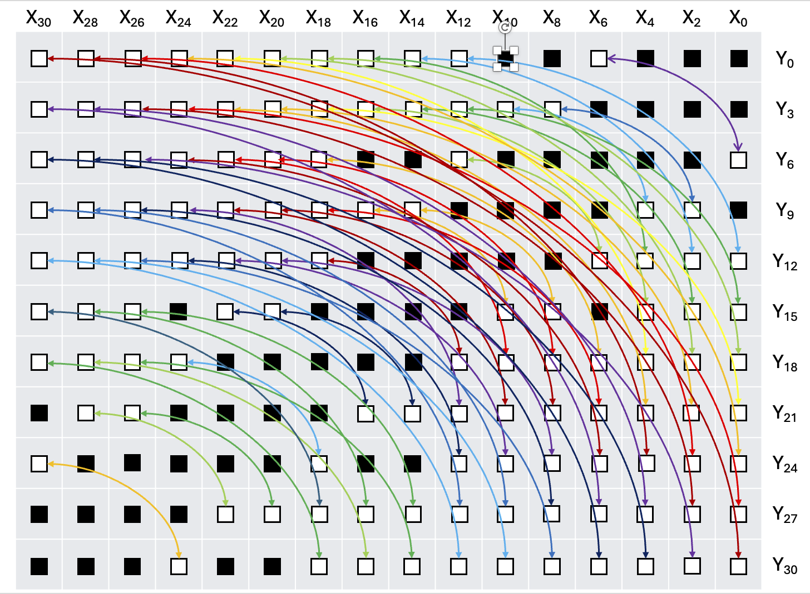

# ModularMultiplier
256-bit Implementation of the Paper "FPGA Modular Multipliers using Hybrid Reduction Techniques" with architectural differences in Karatsuba Multiplication style, using Xilinx Vivado

Prototyping and Testing done on a Nexys4 DDR FPGA board (Artix-7 FPGA).

The overall operation that we are aiming for is:

$$
Q \leftarrow X \cdot Y \pmod{M}
$$

The pre-computed values present here are taken when considering the modulus:

$$
M = E3B8C1E9392456DE3EB13B9046685257BDD640FB06671AD11C80317FA3B1799D_{\text{16}}
$$

This operation is being done via the usage of the following steps:

- 1 Full Multiplication (256x256)
- 1 Folding-based Reduction
- Coarse Grain Reduction
- Fine Grain Reduction

The architecture implemented here was as shown below:

The Karatsuba Multiplier was inspired by FloPoCo, specifically for the usage of Rectangular Karatsuba Multipliers to account for 25x18 DSP48E1 blocks in Nexys4 DDR. The tiling was done as shown below:

## Implementation Comparison

Our results and the corresponding comparison to that of the paper's implementation on state-of-the-art FPGA can be seen below:

| Metric                     | Paper's Implementation        | Our Implementation           |
|----------------------------|-------------------------------|------------------------------|
| **FPGA Family**            | Agilex 7                      | Artix 7                      |
| **Logic Resources**        | 11,505 ALMs                   | 18,960 LUTs                  |
| **Flip-Flops**             | — *(included in ALMs)*        | 15,015 FFs                   |
| **DSP Blocks**             | 75                            | 205                          |
| **BRAM / Memory Blocks**   | 105 M20Ks                     | 68 BRAMs                     |
| **Latency**                | 57 cycles                     | **28 cycles**                   |
| **FMax (Achieved)**        | 804 MHz                       | 102 MHz                      |
| **Maximum Operational Frequency of FPGA** | ~600–700 MHz                      | 100 MHz                      |
| **Throughput (steady-state)** | **804 M ops/s**  *(if II = 1)* | **102 M ops/s** |

## Karatsuba Multiplier – Implementation Comparison

The Karatsuba Multiplier in particular had the following utilisation:

| Metric | Paper’s Implementation | Our Implementation |
|------|------------------------|--------------------|
| **FPGA Family** | Agilex 7 | Artix 7 (Nexys4 DDR) |
| **Logic Resources** | 5,147 ALMs | 7,284 LUTs |
| **Flip-Flops** | — *(included in ALMs)* | 4,869 FFs |
| **DSP Blocks (raw)** | 45 | 127 |
| **DSP Blocks (normalized\*)** | 45 (27×27) | ~78 (27×27 equiv.) |
| **Latency** | 23 cycles | **8 cycles** |
| **FMax (Achieved)** | 865 MHz | 102 MHz |
| **Maximum Operational Frequency of FPGA** | ~600–700 MHz | 100 MHz |
| **Throughput (steady-state)** | 865 M mult/s *(if II = 1)* | **102 M mult/s** |

### Notes

- ALMs and LUTs are not directly comparable; ALMs are more expressive and include flip-flops.
- DSP normalization is based on multiplier bit-capacity (27×27 vs 25×18).
- Our implementation is fully pipelined (II = 1); the reference does not specify pipelining.
- Throughput assumes one output per initiation interval in steady state.

